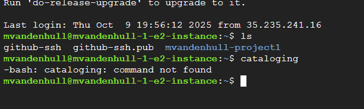
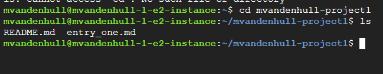
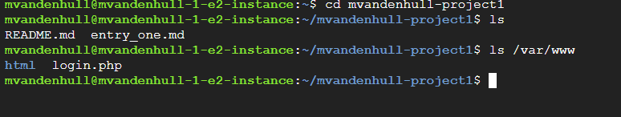
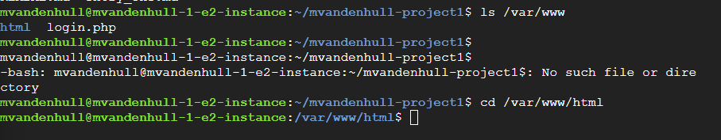
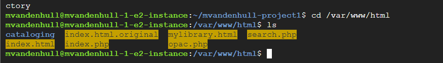
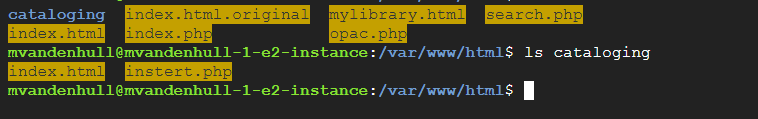
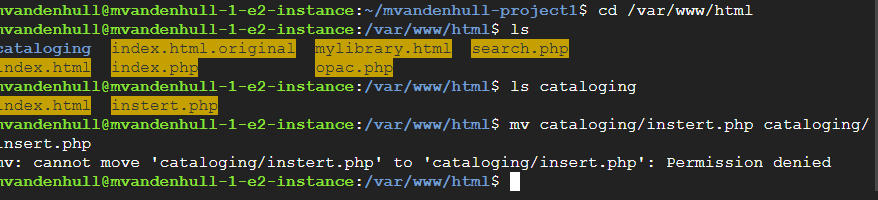
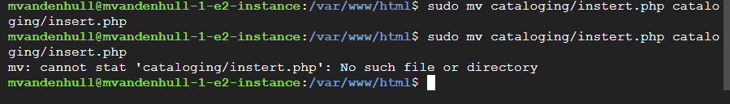

# Fixing my OPAC
Once I finished creating my OPAC, I realized that the cataloging portion of the website did not work. So, I looked at the main folder filed to figure out what went wrong. 

From here, I navigated to my website folder using "cd-mvandenhull-project1"

Then I used "ls" to find what I had in the system. 

Next, I went into "ls /var/www/html"

And then ran "cd /var/www/html"

I ran "ls" agian to see what my options were once again.

Then what the issue I discovered that I accidentally named a file as "instert" instead of "insert", so I have to move the folder. So I ran "mv cataloging/instert.php cataloging/insert.php"

Didn't quited work right, so I realized I needed "sudo" at the front, aka "sudo mv cataloging/sintert.php cataloging/insert.php"

