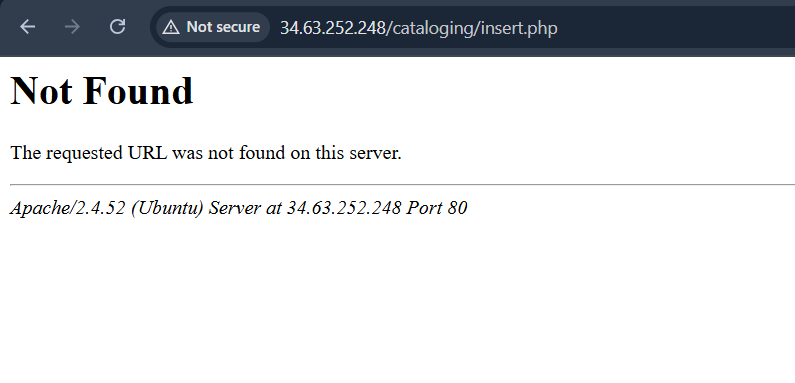

# OPAC Book Cataloging Fails When Creating New Catalog Entry

This page describes how to resolve an issue that comes up when the insert.php file in the simple OPAC application is NOT FOUND. This error occurs when you attempt to add a new book into the page "cataloging/index.html" but you receive a "Not Found" page when you hit "Submit" to enter the book. 

The main issue is the file "cataloging/insert.php" is not present. You can double check that you are having this issue by reading the URL bar. If it ends in "cataloging/insert.php", and you are seeing the "Not Found" error page as shown above, this page can help you. If not, you are most likely to be encountering another issue that this page cannot assist you with.

The problem is resolved by ensuring that the file "cataloging/index.php has the appropriate name as well as contents. To start correcting this error, navigate to the folder containing your cataloging pages. I'm using Apache on Ubuntu, so for me this was "/var/www/html". Then use "ls" to verify that the "cataloging" directory is contained in "/var/www/html" as you'd expect. 

## Determining the Solution

There are 2 main categories for mistakes that create this error. The first is to create a file with the correct contents for "insert.php", but to name it incorrectly and/or place it in the wrong location. The second is to fail to create a file at all. If you run "ls" as above and "ls cataloging", as shown below, to view the website root and the cataloging folder, you see a file that looks like it should be located at "cataloging/insert.php" but isn't, you have the former problem and the best solution is to move that file to the correct location. If you do not see such a file, you likely have the latter problem and should follow solution 2. 

## Solutions

### Solution 1: File Created but Misplaced or Misnamed
In my case, I made a typo when creating the file and named it "instert.php". If this is the case, you can use, "mv" to move it to the correct name and location. 

Relative to the root of your website ("/var/www/html" for me), this is "cataloging/insert.php". I ran the command "sudo mv cataloging/instert.php cataloging/insert.php". This solved my error for me.

### Solution 2
If the "insert.php" file doens't exist at all, you will need to create it and populate it with the appropriate contents. Use your preferred text editor to create the file and give it the contents included in Dr. Ridenour's (or your professors/employers) instructions. If you use "nano", the command would be "nano cataloging/insert.php"

## Conclusion

After all of this my cataloging part of the website started to work! I then (very excitedly) entered several books, and was very happy. I wish you luch in troubleshooting!

After all of this, my cataloging part of the website started to work! I then entered several books, and was very happy. 
